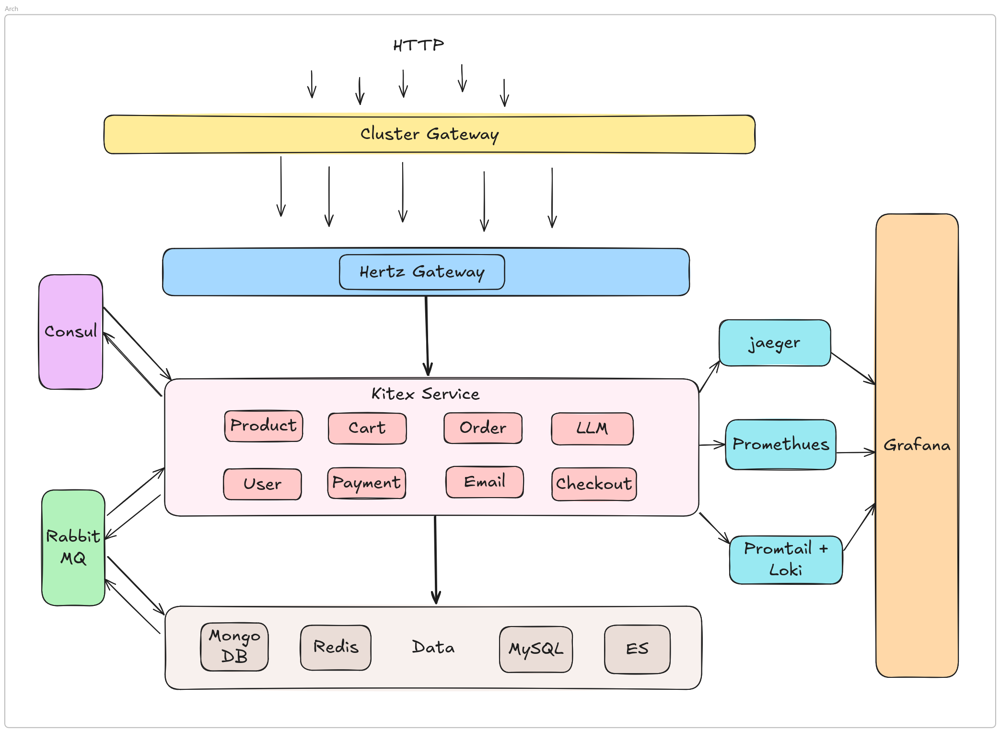

# Youthcamp-2025-mall-be

2025寒假 豆包MarsCode & 字节跳动青训营 后端抖音电商项目

[Api文档](https://6hdcvb05pf.apifox.cn/)

## 技术栈
| 名称                         | 用途                                     |
|----------------------------|----------------------------------------|
| Hertz                      | HTTP 框架                              |
| Kitex                      | RPC 框架                               |
| JWT                        | 身份认证                               |
| Casbin                     | 权限控制                               |
| Consul                     | 注册中心                               |
| MongoDB                    | 对话数据等非结构化数据持久化           |
| MySQL                      | 结构化数据持久化                       |
| Redis                      | 缓存、分布式锁、分布式 id、限流等       |
| Elasticsearch              | 商品搜索引擎                           |
| Opentelemetry              | 收集、处理和导出 监控数据               |
| RabbitMQ                   | 流量削峰、消息传递等                   |
| Docker & Docker compose    | 快速构建环境                           |
| Prometheus & Grafana       | 指标存储和展示                         |
| Jaeger & Promtail & Loki   | 链路追踪、日志收集、存储和查询         |
| Eino                       | LLM 应用开发                          |
| 火山舟大模型服务平台       | 提供 embedding、chatmodel 等模型支持 |

## 架构


## 根目录
```
├── app                     # 核心业务应用服务
│   ├── cart                # 购物车服务
│   ├── checkout            # 结算服务
│   ├── email               # 邮件通知服务
│   ├── gateway             # API 网关
│   ├── llm                 # 智能体服务
│   ├── order               # 订单管理服务
│   ├── payment             # 支付服务
│   ├── product             # 商品管理服务
│   ├── user                # 用户管理服务
│
├── common                  # 公共工具函数和通用组件
├── db                      # 数据库相关，包括连接、迁移、模型定义等
├── deploy                  # 部署相关配置，如 Kubernetes、Docker 等
├── idl                     # 接口定义文件（Interface Definition Language）
├── rpc_gen                 # RPC 代码生成目录，存放自动生成的 RPC 代码
├── scripts                 # 脚本目录，包含自动化运维或开发工具脚本
│
├── .gitignore              # Git 忽略文件
├── docker-compose.yaml     # Docker Compose 配置文件
├── go.work                 # Go 工作区文件，管理多个 Go 模块
├── go.work.sum             # 依赖项校验文件
├── Makefile                # 项目构建、运行和管理的 Makefile
├── README.md               # 项目说明文档
```

## 功能实现
- [x] 用户注册、登录
- [x] 商品列表，详情，搜索，分类
- [x] 商品秒杀
- [x] 购物车添加，修改，删除
- [x] 订单中心
- [x] 支付中心
- [x] 智能体问答，商品搜索，自动下单


## Contributors
- [Whitea029](https://github.com/Whitea029)
- [kyzyc](https://github.com/kyzyc)
- [ZQDesigned](https://github.com/ZQDesigned)
